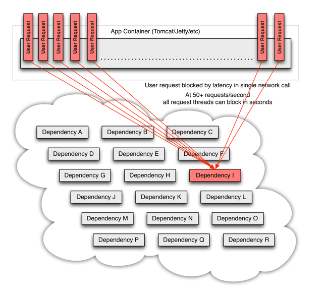

# Hystrix

In a distributed environment, inevitably some of the many service dependencies will fail.

Hystrix is a liberary that helps you control the interactions between these distribute 
services by `adding latency tolerance` and `fault tolerance logic`. Hystrix does this by 
`isolating points` of access between the services, stopping cascading failures across them
abd providing fallback options, all of which improve your system's overall resiliency.

# What is Hystrix for?

Hystrix is designed to do the following:

- Give protection from and control over latency and failure from dependences accessd(typically 
over the nextwork) via third-party client libraries

- Stop cascading failures in a complex distributed system.
- Fail fast and rapidly recover.
- Fallback and gracefully degrade when possible
- Enable near real-time monitoring, alerting, and operational control.

# What Problem does Hystrix solve?

When everything is healthy the request flow can like this:

When one of many backend system becomes latent it can block the entire user request:

With high volume traffic a single backend dependency becoming latent can cause all resources
 to become saturated in seconds on all servers.
 
Every point in an application that reaches out over the network or into a client library that
might result in network requests is a source of potential failure. Worse then failures, these
applications can also result in increased latencies between services, which backs up queues,
threads, and other system resources causing even more cascading failures across the system.

These issues are exacerbated then network access is performed through a third-party client —— 
a "black box" where implementation details are hidden and can change ar any time, and network
or resource configurations are different for each client library and often difficult to monitor
and change.

